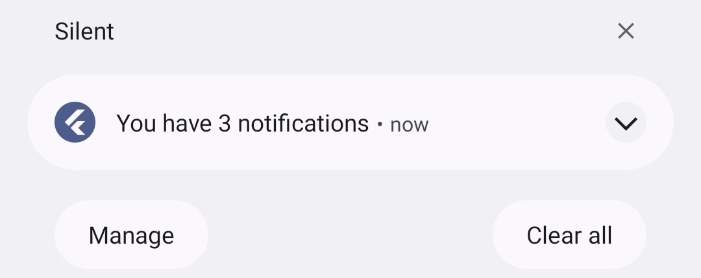

# flutter_super_badge

A native plugin to update the app badge count on the app icon.

Inspired by [flutter_app_badger][flutter_app_badger] & [flutter_app_badge_control][flutter_app_badge_control].

<p>
    
    
</p>

## Supported Platforms

|                       | Android | iOS |
| --------------------- | ------- | --- |
| `updateBadgeCount`    | ✅      | ✅  |
| `removeBadge`         | ✅      | ✅  |

## Getting Started

You will have to request for notification permissions (e.g. with [permission_handler][permission_handler])

```dart
Permission.notification.isDenied.then((value) {
    if (value) Permission.notification.request();
});
```

### iOS

On iOS, you will have to add the following to your `Info.plist` file:

```xml
<key>UIBackgroundModes</key>
<array>
    <string>remote-notification</string>
</array>
```

### Android

There's no official API to update the app badge count on Android. To ensure that at least the dot indicator is displayed on the launcher icon, a collapsed notification with the count is created.

<p>
    
</p>

Some launchers support the notification count display. The integration is done via the [ShortcutBadgerX][shortcutbadgerx] (forked from [ShortcutBadger][shortcutbadger]) library.

#### Supported Launchers

<table>
    <tr>
        <td width="130">
            <h3>Sony</h3>
            
        </td>
        <td width="130">
            <h3>Samsung</h3>
            
        </td>
        <td width="130">
            <h3>LG</h3>
            
        </td>
        <td width="130">
            <h3>HTC</h3>
            
        </td>
    </tr>
    <tr>
        <td width="130">
            <h3>ASUS</h3>
            
        </td>
        <td width="130">
            <h3>ADW</h3>
            
        </td>
        <td width="130">
            <h3>APEX</h3>
            
        </td>
        <td width="130">
            <h3>NOVA</h3>
            
        </td>
    <tr>
        <td width="130">
            <h3>Yandex</h3>
            
            (1.1.23+)
        </td>
        <td width="130">
            <h3>Huawei</h3>
            
            (1.1.7+)
        </td>
        <td width="130">
            <h3>ZUK</h3>
            
            (1.1.10+)
        </td>
        <td width="130">
            <h3>OPPO</h3>
            
            (1.1.10+)
        </td>
    </tr>
    <tr>
        <td width="130">
            <h3>EverythingMe</h3>
            
        </td>
        <td width="130">
            <h3>ZTE</h3>
            
            (1.1.17+)
        </td>
        <td width="260" colspan="2">
            <h3>KISS</h3>
            
            (1.1.18+)
        </td>
    </tr>
    <tr>
        <td width="130">
            <h3>LaunchTime</h3>
            
        </td>
    </tr>
</table>

## TODO

### Android

- Make the notification tap customizable

[flutter_app_badger]: https://pub.dev/packages/flutter_app_badger
[flutter_app_badge_control]: https://pub.dev/packages/flutter_app_badge_control
[permission_handler]: https://pub.dev/packages/permission_handler
[shortcutbadgerx]: https://github.com/rlgo/ShortcutBadgerX
[shortcutbadger]: https://github.com/leolin310148/ShortcutBadger